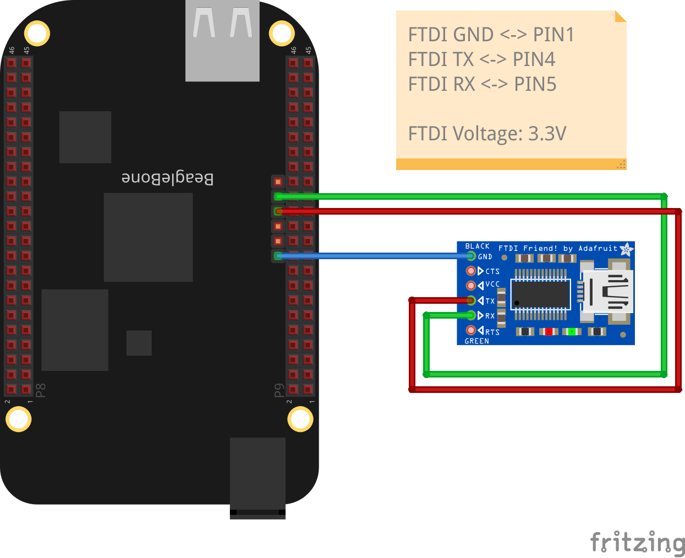

Tested with Buildroot version 2025.02.3, which can be obtained from [here](https://buildroot.org/downloads/buildroot-2025.02.3.tar.xz) and a Beaglebone Black.

# Building it

1. Download source code:
```console
wget https://buildroot.org/downloads/buildroot-2025.02.3.tar.xz
```

2. unpack the tarball and change to custom name:
```console
tar xf buildroot-2025.02.3.tar.xz
mv buildroot-2025.02.3 buildroot-2025.02.3-bbb
```

3. generate makefile, then open the interactive menu to cutomize:
```console
make beaglebone_defconfig
make menuconfig
```
Definitely, you want to set the root password at *System configuration*.

4. compile, possibly in parallel:
```console
make -j10
```

5. Go to `output/images` and copy the SD card image:
```console
sudo dd if=output/images/sdcard.img of=/dev/sdf
```

6. Plug the card into SD slot of your BBB, power on and check the UART interface.

# How to access the UART

BBB operates on 3.3V, make sure FTDI is set the same way. Connect GND to PIN 1, TX to PIN 4 and RX to PIN 5:



Use `minicom` or `screen` to connect:
```console
sudo screen /dev/ttyUSB0 115200
```
